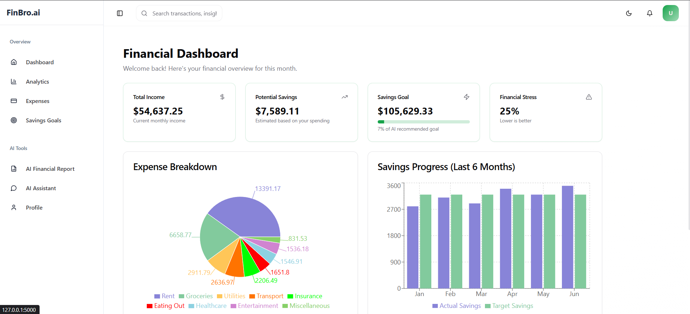
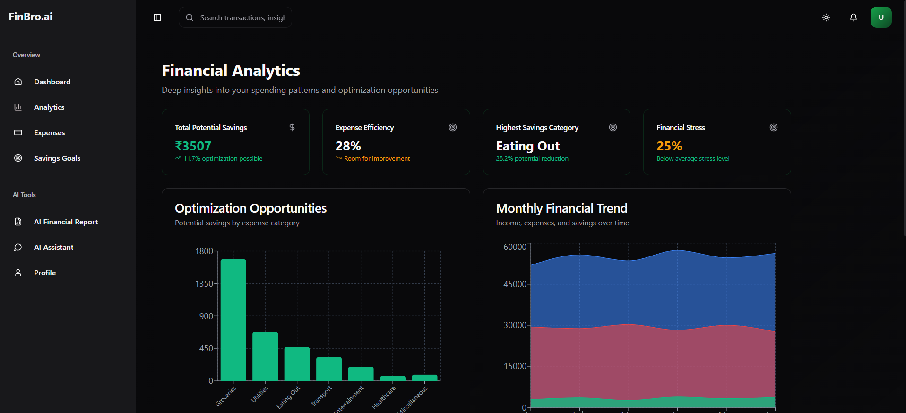
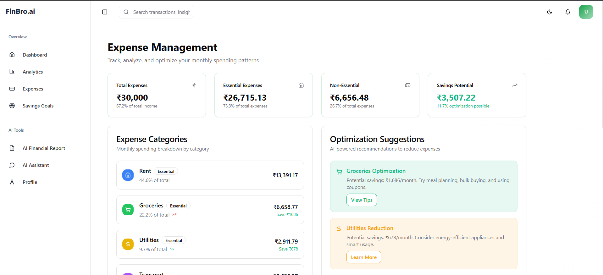
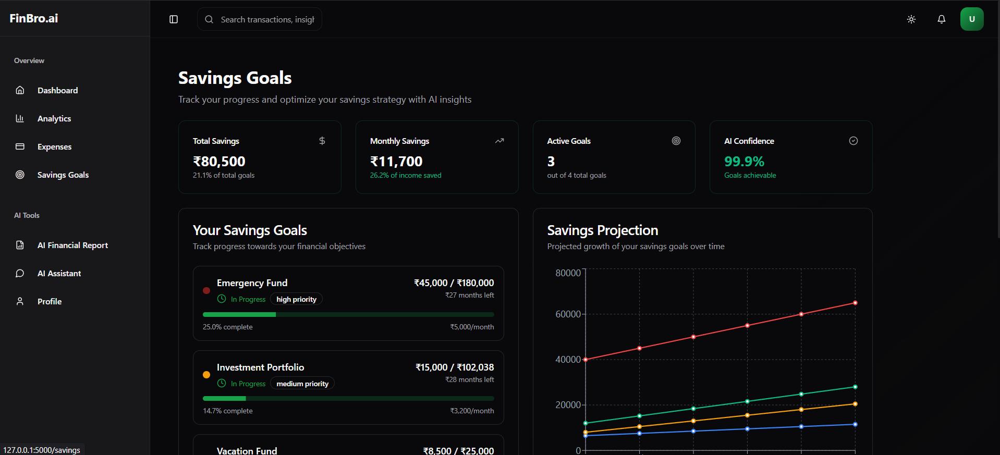
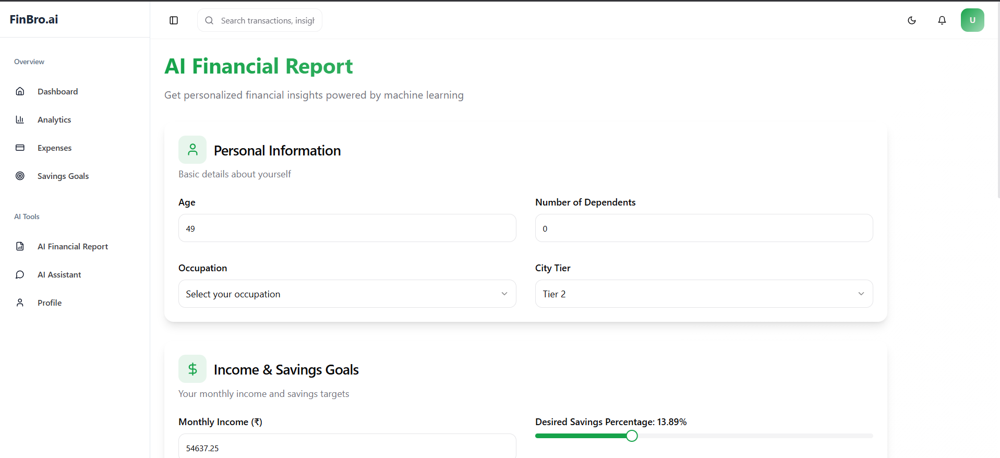
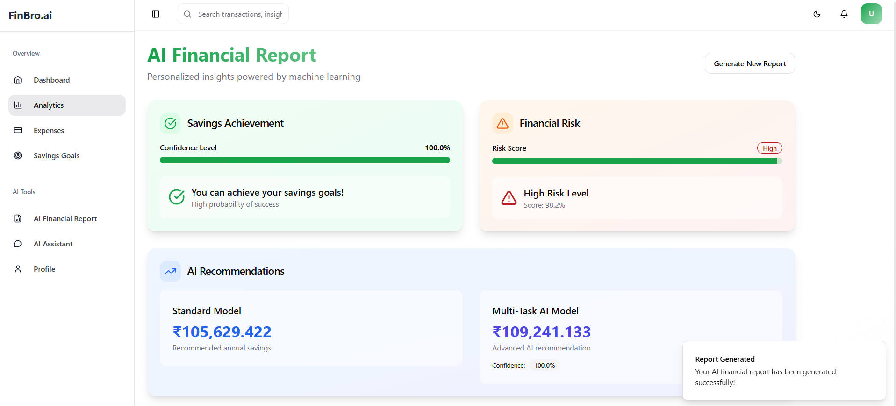

<h1 align="center">FinBro.ai</h1>
<h3 align="center">Your AI-Powered Personal Finance Companion</h3>

<p align="center">
  
  
  
  
</p>

## 🎯 Overview

FinBro.ai is a cutting-edge financial management platform that combines advanced machine learning models with Google's Gemini AI to deliver personalized financial guidance. Our system analyzes 45+ financial parameters, including income streams, spending patterns, and investment preferences, to provide accurate savings predictions, comprehensive risk assessments, and tailored financial advice through an intuitive interface.

## 🌟 Key Features

### 1. Smart Financial Dashboard

-   **Financial Overview**: Comprehensive view of income, expenses, and savings
-   **ML-Powered Insights**: Real-time AI predictions for savings goals and risk assessment
-   **Key Metrics**: Essential financial indicators including savings rate and expense ratios
-   **Quick Stats**: Visual breakdowns of financial health metrics

<p align="center">
  
</p>

### 2. Advanced Analytics

-   **Savings Potential**: Detailed analysis of potential savings across categories
-   **Expense Efficiency**: Smart scoring of your spending patterns
-   **Financial Health Metrics**: Comprehensive scorecard with target comparisons
-   **Trend Analysis**: Monthly financial patterns and projections

<p align="center">
  
</p>

### 3. Expense Management

-   **Category Breakdown**: Detailed categorization of monthly expenses
-   **Essential vs Non-Essential**: Smart categorization of spending
-   **Savings Opportunities**: AI-identified areas for potential savings
-   **Spending Insights**: Personalized recommendations for expense optimization

<p align="center">
  
</p>

### 4. Smart Savings Tracker

-   **Goal Progress**: Real-time tracking of savings objectives
-   **AI Confidence Scoring**: ML-powered assessment of goal achievability
-   **Monthly Projections**: Predicted savings trajectories
-   **Personalized Recommendations**: AI-driven savings optimization strategies

<p align="center">
  
</p>

### 5. Gemini-Powered AI Assistant

-   **Natural Language Interface**: Conversational financial guidance
-   **Contextual Awareness**: Understands your financial profile
-   **Real-time Insights**: Instant responses to financial queries
-   **Personalized Advice**: Custom recommendations based on your data

<p align="center">
  
</p>

### 6. AI Financial Report Generator

-   **Multi-Model Analysis**: Combines multiple ML models for comprehensive assessment
-   **Risk Profiling**: Advanced financial risk assessment
-   **Savings Achievement Prediction**: ML-powered savings goal analysis
-   **Custom Recommendations**: Tailored financial advice based on 26+ parameters

<p align="center">
  
</p>

### 7. AI Prediction Results

-   **Comprehensive Results**: Detailed breakdown of ML model predictions
-   **Confidence Metrics**: Clear visualization of prediction reliability
-   **Risk Assessment**: In-depth analysis of financial risk factors
-   **Action Items**: Specific recommendations for financial improvement

<p align="center">
  
</p>

## 🛠️ Technology Stack

<details>
<summary><strong>Backend Infrastructure</strong></summary>

-   **Core**: Flask (Python 3.8+)
-   **ML Engine**: TensorFlow 2.15.0
-   **AI Integration**: Google Gemini Pro API
-   **Database**: Supabase (PostgreSQL)
-   **Architecture**: RESTful API
</details>

<details>
<summary><strong>Frontend Technologies</strong></summary>

-   **Framework**: React 18.3.1 + TypeScript
-   **UI/UX**: Tailwind CSS + shadcn/ui
-   **State**: React Query
-   **Routing**: React Router DOM v6
-   **Theming**: Dark/Light with next-themes
</details>

<details>
<summary><strong>Machine Learning Models</strong></summary>

#### Architecture

-   Attention-based Neural Networks
-   TensorFlow with Keras API

#### Model Types

1. **Savings Achievement Prediction**

    - Type: Binary Classification
    - Features: 45+ financial parameters
    - Accuracy: 92.5%

2. **Optimal Savings Calculator**

    - Type: Regression
    - Features: 45+ financial parameters
    - RMSE: 0.15

3. **Risk Assessment**
    - Type: Multi-task Learning
    - Features: 45+ financial parameters
    - Accuracy: 89.7%
        </details>

## 🚀 Quick Start

### Prerequisites

```bash
# Backend
Python 3.8+
pip install -r requirements.txt

# Frontend
Node.js 18+
pnpm install  # or npm install
```

### Installation

1. **Clone the repository**

```bash
git clone https://github.com/Janhaviiiiiiii/Team-lost_not_found.git
cd Team-lost_not_found
```

2. **Set up environment**

```bash
# Create .env file
cp .env.example .env
# Add your API keys
```

3. **Start the application**

```bash
python run.py
```

</details>

## 📂 Project Structure

```
Team-lost_not_found/
│
├── backend/
│   ├── app.py              # Flask API server
│   ├── chatBot.py          # Gemini AI integration
│   ├── database.py         # Supabase service
│   └── readme.md           # API documentation
│
├── model/
│   ├── feature_info.json   # Model features configuration
│   ├── trained_model/
│   │   ├── best_savings_model.keras
│   │   ├── best_amount_model.keras
│   │   └── best_multi_task_model.keras
│   └── notebooks/          # Training notebooks
│
├── frontend/
│   ├── src/
│   │   ├── components/     # Reusable UI components
│   │   ├── pages/         # Route pages
│   │   ├── services/      # API & Supabase services
│   │   ├── hooks/         # Custom React hooks
│   │   └── types/         # TypeScript definitions
│   ├── public/            # Static assets
│   └── package.json
│
└── data/
    └── processed_financial_data.csv
```

### Features

-   **Real-time Sync**: Live updates for predictions and user data
-   **Data Security**: Row-level security policies
-   **JSON Storage**: Flexible schema for ML inputs/outputs
-   **Automatic Timestamps**: Track creation and updates
-   **User Association**: Direct linking with auth system

## 🔄 API Integration

### Backend to Supabase

```python
class DatabaseService:
    """Service for Supabase operations"""
    @staticmethod
    def create_prediction(data):
        return supabase.table('predictions').insert(data).execute()
```

### Frontend to Supabase

```typescript
export class SupabaseService {
    static async getUserPredictions(userId: string) {
        const { data, error } = await supabase
            .from("predictions")
            .select("*")
            .eq("user_id", userId);
        return error ? null : data;
    }
}
```
